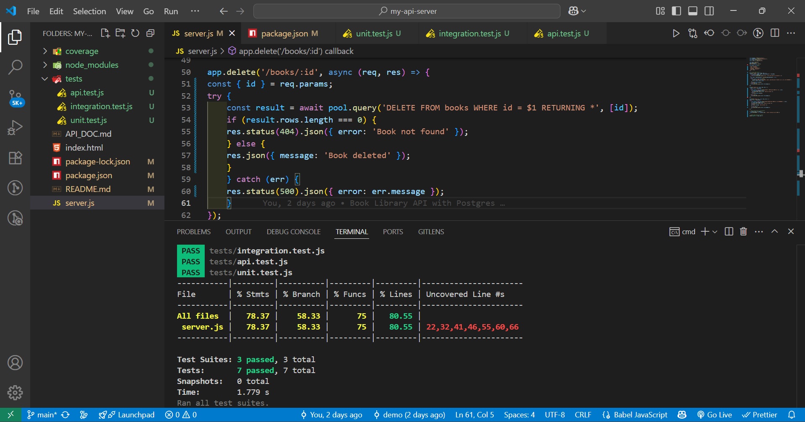

# Node.js + Postgres Book API

## About
This project is a simple API for managing books using Node.js + Express + PostgreSQL.

## Endpoints
- POST /api/books → Create book
- GET /api/books → List books
- PUT /api/books/:id → Update book
- DELETE /api/books/:id → Delete book

## Setup
1. Create Postgres DB + table
2. Update DB config in server.js
3. Run server: `node server.js`

## Book Library API
Tech: Node.js, Express, PostgreSQL  
Test: Jest, Supertest  

### Run app
npm start

### Run tests
npm test

### Coverage
See below screenshot

### Session 4 :  API Testing with AI & CI/CD Integration
 
